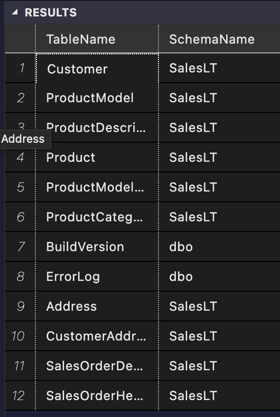
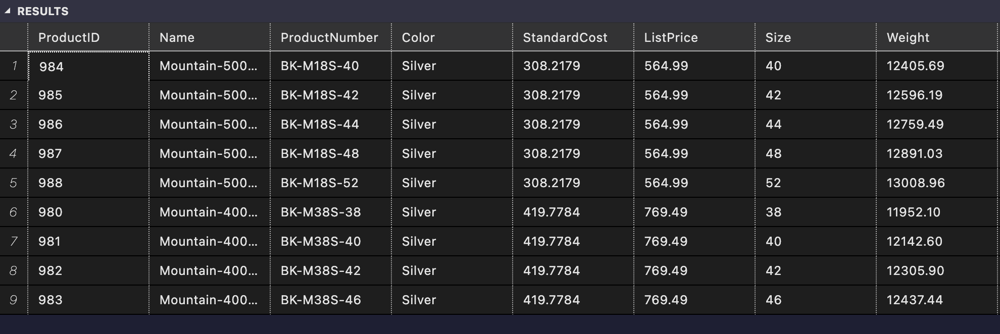

## Prerequisites

- A database connection is required to execute the scripts in this file.
- Make sure you have the necessary permissions to retrieve data from the database.

## Usage
- Open a SQL client or database management tool.
- Connect to the database where you want to retrieve data.

- SELECT t.name as TableName, s.name as SchemaName
- FROM sys.tables t 
- INNER JOIN sys.schemas s ON t.schema_id = s.schema_id

- The following query retrieves the names of all tables in the database:

- SELECT *
- FROM SalesLT.Product p
- LEFT JOIN SalesLT.ProductCategory c ON p
- ProductCategoryID = c.ProductCategoryID
- WHERE c.ProductCategoryID = 5
- AND p.Color = 'Silver'
- AND p.ListPrice < 1000
- ORDER BY p.ListPrice ASC

- The following query retrieves the items in the `Product` table that are silver and cost less than $1000:
- 

